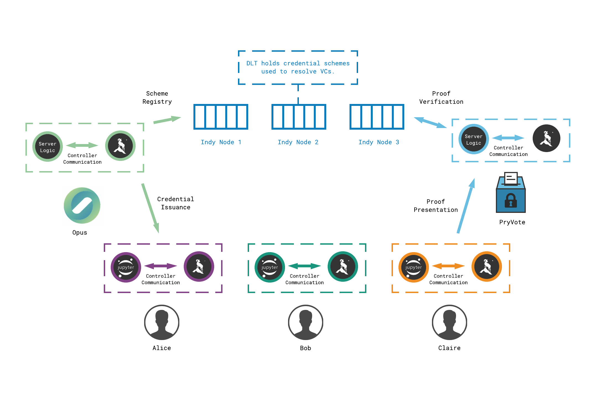

# PyDentity



In this repo, we're extending a [Distributed Trust System for Privacy Preserving Machine Learning](https://arxiv.org/abs/2006.02456) to work with PySyft. We're using HL-Aries Agents to establish an end-end encrypted channel which will facilitate syft communications. We can then extend this with credentials and governance systems.

# Requirements

* Docker
* Docker Compose v1.24

# Getting Started

From root directory run:
```
./manage up
```

Navigate to [researcher notebook](http://localhost:8889), you will find the token for this in the terminal you ran ./manage up from.

Navigate to [data notebook](http://localhost:8888), you will find the token for this in the terminal you ran ./manage up from.

Both jupyter instances should have a notebook, either researcher or data_owner. Open these up and follow the tutorial contained within the notebooks. You can view these notebooks from this repo in the demo folder.

# Sequence Diagram

Built using [Sequence Diagram](https://sequencediagram.org)


